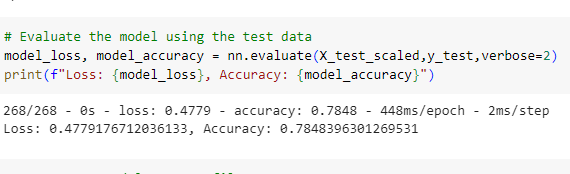

# deep-learning-challenge

In this challenge, machine learning techniques and neural network are used to solve a binary classification problem predicting the success or failure of the applicants. 

## Background
The nonprofit foundation Alphabet Soup wants a tool that can help it select the applicants for funding with the best chance of success in their ventures. From Alphabet Soup’s business team, a CSV file is received containing more than 34,000 organizations that have received funding from Alphabet Soup over the years. This dataset contains columns that capture metadata about each organization, such as:

EIN and NAME—Identification columns 
APPLICATION_TYPE—Alphabet Soup application type 
AFFILIATION—Affiliated sector of industry 
CLASSIFICATION—Government organization classification 
USE_CASE—Use case for funding 
ORGANIZATION—Organization type 
STATUS—Active status 
INCOME_AMT—Income classification 
SPECIAL_CONSIDERATIONS—Special considerations for application 
ASK_AMT—Funding amount requested 
IS_SUCCESSFUL—Was the money used effectively 

## Data Preprocessing
* target variable - 'IS_SUCCESSFUL' — was the money used effectively
* feature variables - all the columns but 'Is SUCCESSFUL' and the 'non-beneficial' columns
* 'EIN' and 'NAME' identification columns seemed to be non-informative columns at the beginning. So, both columns were removed.  

## Compiling, Training, and Evaluating the Model
Many trials were performed to compile, train and evaluate the model with different parameters. In order to increase the performance of the model, more hidden layers were added, keeping all the parameters the same. More neurons were added, again, keeping the parameters the same, another activation function ('Tanh' instead of 'Sigmoid') was used for the output layer, and many other changes were tried to improve the performance. However, in all of these cases the accuracy was around 72%, and the loss was at least 56%.  
The best result was achieved when 'NAME" column was added back to the dataframe. As it was 
a categorical column with more than 10 unique values, the binning process was applied to it, and some of it's rare values were binned into 'Other' group. This time the accuracy was 78% and the loss was 47%.

## The Best Result in Terms of Accuracy

Changing the number of neurons did not make a significant increase of the accuracy. It increased when the previously removed column 'NAME' was added back with the following parameters: 
first hidden layer - 96 neurons, second hidden layer - 50 neurons, the number of hidden layers - 2, activation function for the first hidden layer - 'relu', for the second hidden layer - 'relu', for the output layer - 'sigmoid'. 
For this model the best score of accuracy was 78% and the loss was 47%.

  

## References
This project is a part of UC Berkeley "Data Analysis and Visualization" Boot Camp education services.
